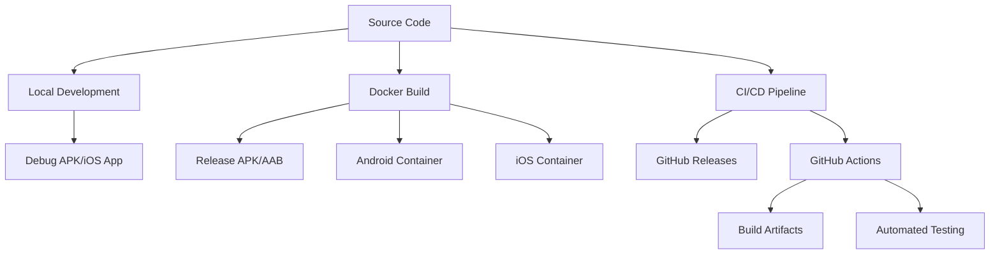
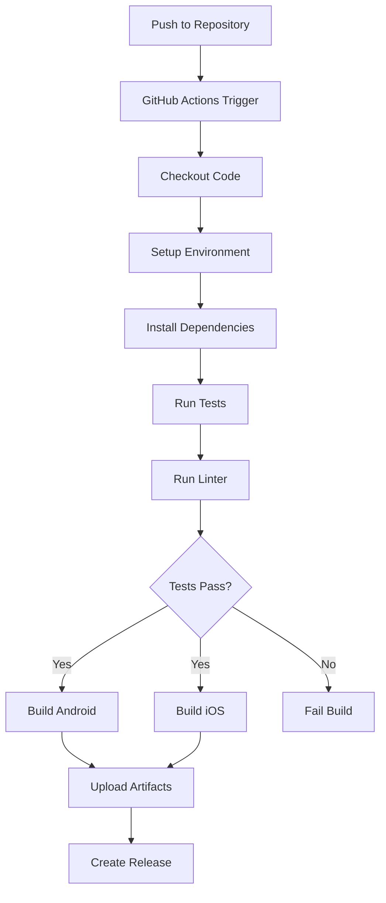

# Build and Deployment

This guide covers building, testing, and deploying Sky Dash using Docker, CI/CD pipelines, and manual build processes. The project includes a comprehensive automated build system for both iOS and Android platforms.

## 📋 Table of Contents

- [Build Overview](#-build-overview)
- [Local Development Builds](#-local-development-builds)
- [Docker Build System](#-docker-build-system)
- [CI/CD Pipeline](#-cicd-pipeline)
- [Manual Production Builds](#-manual-production-builds)
- [Release Process](#-release-process)
- [Environment Configuration](#-environment-configuration)
- [Troubleshooting Builds](#-troubleshooting-builds)

## 🏗️ Build Overview

Sky Dash supports multiple build configurations:

| Build Type | Platform | Output | Use Case |
|------------|----------|--------|----------|
| **Development** | Android/iOS | Debug APK/App | Local testing |
| **Docker Debug** | Android | Debug APK | Containerized development |
| **Docker Release** | Android | Release APK/AAB | Production builds |
| **CI/CD** | Android/iOS | Release artifacts | Automated deployment |

### Build Architecture



## 🚀 Local Development Builds

### Quick Development Build

```bash
# Start Metro bundler
npm start

# Run on Android (debug)
npm run android

# Run on iOS (debug, macOS only)
npm run ios
```

### Manual Release Builds

#### Android Release APK
```bash
# Build release APK
npm run build:android

# Output location
# android/app/build/outputs/apk/release/app-release.apk
```

#### iOS Release Build (macOS only)
```bash
# Build iOS release
npm run build:ios

# Alternative: Use Xcode
open ios/FlappyBirdClone.xcworkspace
# Then: Product → Archive
```

### Build Scripts

The project includes several npm scripts:

```json
{
  "scripts": {
    "start": "react-native start",
    "android": "react-native run-android",
    "ios": "react-native run-ios",
    "build:android": "cd android && ./gradlew assembleRelease",
    "build:ios": "react-native run-ios --configuration Release",
    "lint": "eslint .",
    "test": "jest --passWithNoTests"
  }
}
```

## 🐳 Docker Build System

The project includes a comprehensive Docker-based build system for consistent, reproducible builds.

### Docker Architecture

```
Dockerfile.base          # Base React Native environment
├── Dockerfile.android   # Android build environment
├── Dockerfile.ios       # iOS build environment (macOS)
└── docker-compose.yml   # Multi-service orchestration
```

### Base Container

**File:** [`Dockerfile.base`](../Dockerfile.base)

```dockerfile
FROM node:18-bullseye

# Install React Native CLI and common tools
RUN npm install -g react-native-cli
RUN npm install -g fastlane

# Set up build environment
WORKDIR /app
COPY package*.json ./
RUN npm install
```

### Android Container

**File:** [`Dockerfile.android`](../Dockerfile.android)

```dockerfile
FROM base-image

# Install Android SDK and build tools
ENV ANDROID_HOME=/opt/android-sdk
ENV PATH=$PATH:$ANDROID_HOME/tools:$ANDROID_HOME/platform-tools

# Install Java 11 and Gradle
RUN apt-get update && apt-get install -y openjdk-11-jdk

# Copy Android project files
COPY android/ ./android/
COPY scripts/build-android.sh ./scripts/

# Build Android APK
CMD ["./scripts/build-android.sh"]
```

### Docker Compose Services

**File:** [`docker-compose.yml`](../docker-compose.yml)

```yaml
version: '3.8'

services:
  # Development server
  dev:
    build:
      context: .
      dockerfile: Dockerfile.base
    ports:
      - "8081:8081"
    volumes:
      - .:/app
      - /app/node_modules
    command: npm start

  # Android build
  android-build:
    build:
      context: .
      dockerfile: Dockerfile.android
    volumes:
      - ./android/app/build/outputs:/app/outputs
    environment:
      - BUILD_TYPE=release

  # Android AAB build
  android-aab-build:
    build:
      context: .
      dockerfile: Dockerfile.android
    volumes:
      - ./android/app/build/outputs:/app/outputs
    command: ./scripts/build-android-aab.sh

  # Testing
  test:
    build:
      context: .
      dockerfile: Dockerfile.base
    command: npm test

  # Linting
  lint:
    build:
      context: .
      dockerfile: Dockerfile.base
    command: npm run lint
```

### Docker Build Commands

```bash
# Start development server
docker-compose up dev

# Build Android APK
docker-compose run --rm android-build

# Build Android AAB (App Bundle)
docker-compose run --rm android-aab-build

# Run tests
docker-compose run --rm test

# Run linter
docker-compose run --rm lint

# Build all services
docker-compose build
```

### Build Scripts

#### Android APK Build Script

**File:** [`scripts/build-android.sh`](../scripts/build-android.sh)

```bash
#!/bin/bash
set -e

echo "🚀 Building Android APK..."

# Install dependencies
npm install

# Clean previous builds
cd android
./gradlew clean

# Build release APK
./gradlew assembleRelease

# Copy output to mounted volume
cp app/build/outputs/apk/release/app-release.apk /app/outputs/

echo "✅ Android APK build complete!"
echo "📦 Output: /app/outputs/app-release.apk"
```

#### Android AAB Build Script

**File:** [`scripts/build-android-aab.sh`](../scripts/build-android-aab.sh)

```bash
#!/bin/bash
set -e

echo "🚀 Building Android App Bundle (AAB)..."

# Install dependencies
npm install

# Clean and build AAB
cd android
./gradlew clean
./gradlew bundleRelease

# Copy output
cp app/build/outputs/bundle/release/app-release.aab /app/outputs/

echo "✅ Android AAB build complete!"
echo "📦 Output: /app/outputs/app-release.aab"
```

## 🔄 CI/CD Pipeline

The project uses GitHub Actions for automated building, testing, and deployment.

### Pipeline Architecture



### GitHub Actions Workflow

**File:** [`.github/workflows/build-mobile-apps.yml`](../.github/workflows/build-mobile-apps.yml)

```yaml
name: Build Mobile Apps

on:
  push:
    branches: [ main, develop ]
  pull_request:
    branches: [ main ]
  release:
    types: [ created ]

jobs:
  test:
    runs-on: ubuntu-latest
    steps:
      - uses: actions/checkout@v3
      
      - name: Setup Node.js
        uses: actions/setup-node@v3
        with:
          node-version: '18'
          cache: 'npm'
      
      - name: Install dependencies
        run: npm install
      
      - name: Run tests
        run: npm test
      
      - name: Run linter
        run: npm run lint

  build-android:
    needs: test
    runs-on: ubuntu-latest
    steps:
      - uses: actions/checkout@v3
      
      - name: Setup Java
        uses: actions/setup-java@v3
        with:
          java-version: '11'
          distribution: 'temurin'
      
      - name: Setup Android SDK
        uses: android-actions/setup-android@v2
      
      - name: Build Android APK
        run: |
          npm install
          cd android
          ./gradlew assembleRelease
      
      - name: Upload APK
        uses: actions/upload-artifact@v3
        with:
          name: android-apk
          path: android/app/build/outputs/apk/release/app-release.apk
          retention-days: 30

  build-ios:
    needs: test
    runs-on: macos-latest
    steps:
      - uses: actions/checkout@v3
      
      - name: Setup Node.js
        uses: actions/setup-node@v3
        with:
          node-version: '18'
          cache: 'npm'
      
      - name: Install dependencies
        run: npm install
      
      - name: Install CocoaPods
        run: |
          cd ios
          pod install
      
      - name: Build iOS
        run: |
          xcodebuild -workspace ios/FlappyBirdClone.xcworkspace \
                     -scheme FlappyBirdClone \
                     -configuration Release \
                     -destination generic/platform=iOS \
                     -archivePath ios/build/FlappyBirdClone.xcarchive \
                     archive
      
      - name: Export IPA
        run: |
          xcodebuild -exportArchive \
                     -archivePath ios/build/FlappyBirdClone.xcarchive \
                     -exportPath ios/build \
                     -exportOptionsPlist ios/ExportOptions.plist
      
      - name: Upload IPA
        uses: actions/upload-artifact@v3
        with:
          name: ios-ipa
          path: ios/build/FlappyBirdClone.ipa
          retention-days: 30

  release:
    if: github.event_name == 'release'
    needs: [build-android, build-ios]
    runs-on: ubuntu-latest
    steps:
      - name: Download Android APK
        uses: actions/download-artifact@v3
        with:
          name: android-apk
      
      - name: Download iOS IPA
        uses: actions/download-artifact@v3
        with:
          name: ios-ipa
      
      - name: Upload Release Assets
        uses: actions/upload-release-asset@v1
        env:
          GITHUB_TOKEN: ${{ secrets.GITHUB_TOKEN }}
        with:
          upload_url: ${{ github.event.release.upload_url }}
          asset_path: ./app-release.apk
          asset_name: sky-dash-android.apk
          asset_content_type: application/vnd.android.package-archive
```

### Pipeline Features

- **Automated Testing**: Runs tests and linting before builds
- **Multi-Platform**: Builds both Android and iOS simultaneously
- **Artifact Management**: Stores build outputs for 30 days
- **Release Automation**: Creates GitHub releases with downloadable assets
- **Environment Isolation**: Each build runs in a clean environment
- **Parallel Execution**: Android and iOS builds run in parallel

## 🔧 Manual Production Builds

### Android Production Build

#### Prerequisites
```bash
# Generate signing key (one-time setup)
keytool -genkeypair -v -keystore my-release-key.keystore \
        -alias my-key-alias -keyalg RSA -keysize 2048 -validity 10000
```

#### Configure Signing

**File:** `android/gradle.properties`
```properties
MYAPP_RELEASE_STORE_FILE=my-release-key.keystore
MYAPP_RELEASE_KEY_ALIAS=my-key-alias
MYAPP_RELEASE_STORE_PASSWORD=*****
MYAPP_RELEASE_KEY_PASSWORD=*****
```

#### Build Commands
```bash
# Clean build
cd android
./gradlew clean

# Build release APK
./gradlew assembleRelease

# Build App Bundle (for Play Store)
./gradlew bundleRelease

# Outputs:
# APK: android/app/build/outputs/apk/release/app-release.apk
# AAB: android/app/build/outputs/bundle/release/app-release.aab
```

### iOS Production Build (macOS only)

#### Prerequisites
- Valid Apple Developer account
- iOS Distribution Certificate
- App Store Provisioning Profile

#### Build Process
```bash
# Install dependencies
cd ios
pod install
cd ..

# Open in Xcode
open ios/FlappyBirdClone.xcworkspace

# In Xcode:
# 1. Select "Any iOS Device" as destination
# 2. Product → Archive
# 3. Distribute App → App Store Connect
```

#### Command Line Build
```bash
# Archive
xcodebuild -workspace ios/FlappyBirdClone.xcworkspace \
           -scheme FlappyBirdClone \
           -configuration Release \
           -destination generic/platform=iOS \
           -archivePath ios/build/FlappyBirdClone.xcarchive \
           archive

# Export IPA
xcodebuild -exportArchive \
           -archivePath ios/build/FlappyBirdClone.xcarchive \
           -exportPath ios/build \
           -exportOptionsPlist ios/ExportOptions.plist
```

## 🚀 Release Process

### Version Management

#### Update Version Numbers

**Android:** `android/app/build.gradle`
```gradle
android {
    defaultConfig {
        versionCode 2
        versionName "1.1.0"
    }
}
```

**iOS:** `ios/FlappyBirdClone/Info.plist`
```xml
<key>CFBundleShortVersionString</key>
<string>1.1.0</string>
<key>CFBundleVersion</key>
<string>2</string>
```

**Package.json:** [`package.json`](../package.json)
```json
{
  "version": "1.1.0"
}
```

### Release Workflow

1. **Prepare Release**
   ```bash
   # Update version numbers
   # Update CHANGELOG.md
   # Test thoroughly
   ```

2. **Create Release Branch**
   ```bash
   git checkout -b release/1.1.0
   git commit -am "Prepare release 1.1.0"
   git push origin release/1.1.0
   ```

3. **Create GitHub Release**
   - Go to GitHub repository
   - Click "Create a new release"
   - Tag: `v1.1.0`
   - Title: `Sky Dash v1.1.0`
   - Description: Release notes
   - Publish release

4. **Automated Build**
   - GitHub Actions automatically builds APK and IPA
   - Artifacts are attached to the release

5. **Manual Distribution** (if needed)
   ```bash
   # Download artifacts from GitHub release
   # Upload to app stores manually
   ```

### Release Checklist

#### Pre-Release
- [ ] Version numbers updated
- [ ] CHANGELOG.md updated
- [ ] All tests passing
- [ ] Manual testing completed
- [ ] Performance verified
- [ ] No console errors

#### Release
- [ ] GitHub release created
- [ ] CI/CD pipeline completed successfully
- [ ] Artifacts generated and attached
- [ ] Release notes published

#### Post-Release
- [ ] Merge release branch to main
- [ ] Tag release in git
- [ ] Update documentation if needed
- [ ] Monitor for issues

## ⚙️ Environment Configuration

### Environment Variables

**File:** `.env.example`
```bash
# Build Configuration
NODE_ENV=production
BUILD_TYPE=release

# Android Signing (for CI/CD)
ANDROID_KEYSTORE_FILE=release.keystore
ANDROID_KEYSTORE_PASSWORD=your_password
ANDROID_KEY_ALIAS=your_alias
ANDROID_KEY_PASSWORD=your_key_password

# iOS Signing (for CI/CD)
IOS_CERTIFICATE_PASSWORD=your_cert_password
IOS_PROVISIONING_PROFILE=your_profile_uuid
```

### GitHub Secrets

For CI/CD pipeline, configure these secrets in GitHub repository settings:

```bash
# Android Signing
ANDROID_KEYSTORE_BASE64    # Base64 encoded keystore file
ANDROID_KEYSTORE_PASSWORD  # Keystore password
ANDROID_KEY_ALIAS         # Key alias
ANDROID_KEY_PASSWORD      # Key password

# iOS Signing (if using CI/CD for iOS)
IOS_CERTIFICATE_BASE64    # Base64 encoded certificate
IOS_CERTIFICATE_PASSWORD  # Certificate password
IOS_PROVISIONING_PROFILE  # Provisioning profile UUID
```

### Docker Environment

**File:** `docker-compose.override.yml` (for local development)
```yaml
version: '3.8'

services:
  android-build:
    environment:
      - ANDROID_KEYSTORE_PASSWORD=${ANDROID_KEYSTORE_PASSWORD}
      - ANDROID_KEY_PASSWORD=${ANDROID_KEY_PASSWORD}
    volumes:
      - ./release.keystore:/app/android/app/release.keystore
```

## 🐛 Troubleshooting Builds

### Common Android Issues

#### Gradle Build Failures
```bash
# Clean Gradle cache
cd android
./gradlew clean
./gradlew --stop

# Clear Gradle cache globally
rm -rf ~/.gradle/caches/
```

#### Signing Issues
```bash
# Verify keystore
keytool -list -v -keystore my-release-key.keystore

# Check gradle.properties
cat android/gradle.properties
```

#### Memory Issues
```bash
# Increase Gradle memory
echo "org.gradle.jvmargs=-Xmx4096m" >> android/gradle.properties
```

### Common iOS Issues

#### CocoaPods Issues
```bash
# Clean and reinstall pods
cd ios
rm -rf Pods/
rm Podfile.lock
pod install
```

#### Xcode Build Issues
```bash
# Clean build folder
rm -rf ios/build/
rm -rf ~/Library/Developer/Xcode/DerivedData/
```

#### Signing Issues
- Verify certificates in Keychain Access
- Check provisioning profiles in Xcode
- Ensure bundle ID matches provisioning profile

### Docker Issues

#### Container Build Failures
```bash
# Rebuild without cache
docker-compose build --no-cache

# Check container logs
docker-compose logs android-build
```

#### Volume Mount Issues
```bash
# Verify volume mounts
docker-compose config

# Check file permissions
ls -la android/app/build/outputs/
```

### CI/CD Issues

#### GitHub Actions Failures
- Check workflow logs in GitHub Actions tab
- Verify secrets are configured correctly
- Ensure all required files are committed

#### Artifact Upload Issues
- Check artifact retention settings
- Verify upload paths are correct
- Ensure sufficient storage quota

---

**Need help with builds?** Check the [Troubleshooting](Troubleshooting) guide or the [Getting Started](Getting-Started) setup instructions.