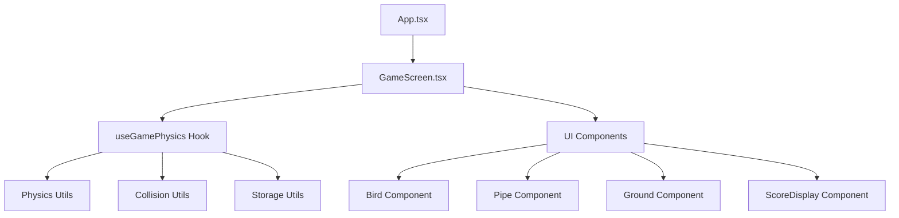
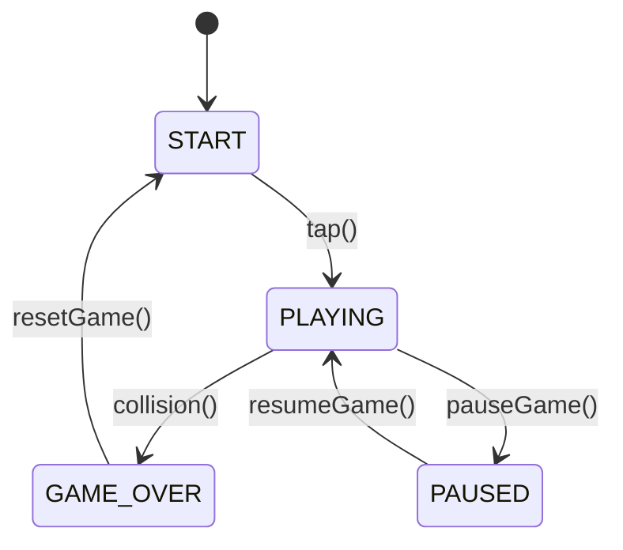

# Game Architecture

This document explains the architectural design, code structure, and key patterns used in Sky Dash. Understanding this architecture will help you navigate the codebase and make effective contributions.

## 🏗️ Overall Architecture

Sky Dash follows a **component-based architecture** with clear separation of concerns:



## 📁 Directory Structure

```
src/
├── components/          # Reusable UI components
│   ├── Bird.tsx        # Bird sprite and animation
│   ├── Pipe.tsx        # Pipe obstacles
│   ├── Ground.tsx      # Ground/floor component
│   └── ScoreDisplay.tsx # Score UI component
├── screens/            # Screen components
│   └── GameScreen.tsx  # Main game screen
├── hooks/              # Custom React hooks
│   └── useGamePhysics.ts # Game logic and physics
├── utils/              # Utility functions
│   ├── physics.ts      # Physics calculations
│   ├── collision.ts    # Collision detection
│   └── storage.ts      # Local storage management
├── types/              # TypeScript type definitions
│   └── index.ts        # Game state interfaces
├── assets/             # Game assets
│   ├── images/         # Sprites and graphics
│   └── sounds/         # Audio files
└── App.tsx             # Main app component
```

## 🎯 Core Design Patterns

### 1. Custom Hook Pattern

The game logic is centralized in [`useGamePhysics.ts`](../src/hooks/useGamePhysics.ts):

```typescript
export const useGamePhysics = () => {
  // Game state management
  const [bird, setBird] = useState<BirdState>({...});
  const [pipes, setPipes] = useState<PipeState[]>([]);
  const [gameState, setGameState] = useState<GameState>('START');
  
  // Game loop with 60 FPS
  useEffect(() => {
    if (gameState === 'PLAYING') {
      gameLoopRef.current = setInterval(() => {
        updateBird();
        updatePipes();
        checkCollisions();
        updateScore();
      }, 16); // ~60 FPS
    }
  }, [gameState]);
  
  return {
    bird, pipes, score, gameState,
    jump, startGame, resetGame
  };
};
```

**Benefits:**
- Separates game logic from UI
- Reusable across different screens
- Easy to test and maintain
- Clear state management

### 2. Component Composition

UI components are small, focused, and composable:

```typescript
// GameScreen.tsx
const GameScreen: React.FC = () => {
  const { bird, pipes, score, gameState, jump } = useGamePhysics();
  
  return (
    <TouchableOpacity onPress={handleScreenPress}>
      <Bird bird={bird} />
      {pipes.map(pipe => <Pipe key={pipe.id} pipe={pipe} />)}
      <Ground />
      <ScoreDisplay score={score} />
    </TouchableOpacity>
  );
};
```

### 3. Utility Module Pattern

Utilities are organized by domain:

```typescript
// physics.ts - Physics calculations
export const PHYSICS_CONFIG = { GRAVITY: 0.5, JUMP_VELOCITY: -8 };
export const calculateBirdRotation = (velocity: number) => {...};

// collision.ts - Collision detection
export const checkBirdPipeCollision = (bird, pipe) => {...};
export const checkAABBCollision = (box1, box2) => {...};

// storage.ts - Data persistence
export const getHighScore = async () => {...};
export const updateHighScore = async (score) => {...};
```

## 🔄 Game State Management

### State Flow Diagram



### State Interface

```typescript
export interface GameStateInterface {
  gameState: GameState;     // 'START' | 'PLAYING' | 'GAME_OVER' | 'PAUSED'
  score: number;
  highScore: number;
  bird: BirdState;
  pipes: PipeState[];
}

export interface BirdState {
  x: number;
  y: number;
  velocity: number;
  rotation: number;
}

export interface PipeState {
  id: string;
  x: number;
  topHeight: number;
  bottomHeight: number;
  passed: boolean;
}
```

## ⚡ Game Loop Architecture

The game runs at 60 FPS using a custom game loop:

```typescript
// 16ms interval = ~60 FPS
setInterval(() => {
  frameCountRef.current += 1;
  
  // Update game objects
  updateBird();      // Apply physics to bird
  updatePipes();     // Move pipes, generate new ones
  checkCollisions(); // Detect collisions
  updateScore();     // Update score when bird passes pipes
}, 16);
```

### Update Cycle

1. **Bird Update**: Apply gravity, update position and rotation
2. **Pipe Update**: Move pipes left, remove off-screen pipes, generate new pipes
3. **Collision Check**: Test bird against pipes, ground, and ceiling
4. **Score Update**: Increment score when bird passes pipes

## 🎨 Component Architecture

### Bird Component

```typescript
const Bird: React.FC<BirdProps> = ({ bird }) => {
  const animatedStyle = {
    transform: [
      { translateX: bird.x },
      { translateY: bird.y },
      { rotate: `${bird.rotation}deg` },
    ],
  };

  return (
    <Animated.View style={[styles.bird, animatedStyle]}>
      <View style={styles.birdBody} />
      <View style={styles.birdWing} />
      <View style={styles.birdEye} />
    </Animated.View>
  );
};
```

**Key Features:**
- Uses `Animated.View` for smooth transforms
- Receives state as props (pure component)
- Rotation based on velocity for realistic movement

### Pipe Component

```typescript
const Pipe: React.FC<PipeProps> = ({ pipe }) => {
  return (
    <>
      {/* Top pipe */}
      <View style={[styles.pipe, {
        height: pipe.topHeight,
        left: pipe.x,
        top: 0,
      }]} />
      
      {/* Bottom pipe */}
      <View style={[styles.pipe, {
        height: pipe.bottomHeight,
        left: pipe.x,
        bottom: GROUND_HEIGHT,
      }]} />
    </>
  );
};
```

## 🔧 Physics System

### Physics Configuration

```typescript
export const PHYSICS_CONFIG: PhysicsConfig = {
  GRAVITY: 0.5,              // Downward acceleration
  JUMP_VELOCITY: -8,         // Upward velocity on tap
  TERMINAL_VELOCITY: 10,     // Maximum fall speed
  PIPE_SPEED: 2,             // Horizontal pipe movement
  PIPE_GAP: 200,             // Gap between top/bottom pipes
  BIRD_SIZE: { width: 32, height: 24 },
  PIPE_WIDTH: 52,
};
```

### Bird Physics

```typescript
const updateBird = useCallback(() => {
  setBird((prevBird) => {
    // Apply gravity
    let newVelocity = prevBird.velocity + PHYSICS_CONFIG.GRAVITY;
    newVelocity = Math.min(newVelocity, PHYSICS_CONFIG.TERMINAL_VELOCITY);
    
    // Update position
    const newY = prevBird.y + newVelocity;
    
    // Calculate rotation based on velocity
    const newRotation = calculateBirdRotation(newVelocity);
    
    return {
      ...prevBird,
      y: newY,
      velocity: newVelocity,
      rotation: newRotation,
    };
  });
}, []);
```

## 🎯 Collision Detection System

### AABB Collision Detection

```typescript
export const checkAABBCollision = (
  box1: CollisionBox,
  box2: CollisionBox
): boolean => {
  return (
    box1.x < box2.x + box2.width &&
    box1.x + box1.width > box2.x &&
    box1.y < box2.y + box2.height &&
    box1.y + box1.height > box2.y
  );
};
```

### Forgiving Hitboxes

```typescript
export const getBirdCollisionBox = (bird: BirdState): CollisionBox => {
  // Make collision box slightly smaller for better gameplay
  const padding = 2;
  return createCollisionBox(
    bird.x + padding,
    bird.y + padding,
    PHYSICS_CONFIG.BIRD_SIZE.width - padding * 2,
    PHYSICS_CONFIG.BIRD_SIZE.height - padding * 2
  );
};
```

## 💾 Data Persistence

### High Score Storage

```typescript
// storage.ts
export const getHighScore = async (): Promise<number> => {
  try {
    const score = await AsyncStorage.getItem(HIGH_SCORE_KEY);
    return score ? parseInt(score, 10) : 0;
  } catch (error) {
    console.error('Error loading high score:', error);
    return 0;
  }
};

export const updateHighScore = async (newScore: number): Promise<number> => {
  try {
    const currentHighScore = await getHighScore();
    if (newScore > currentHighScore) {
      await AsyncStorage.setItem(HIGH_SCORE_KEY, newScore.toString());
      return newScore;
    }
    return currentHighScore;
  } catch (error) {
    console.error('Error updating high score:', error);
    return currentHighScore;
  }
};
```

## 🎮 Input Handling

### Touch Input System

```typescript
const handleScreenPress = () => {
  if (gameState === 'START') {
    startGame();
  } else if (gameState === 'PLAYING') {
    jump();
  } else if (gameState === 'GAME_OVER') {
    resetGame();
  }
};

const jump = useCallback(() => {
  if (gameState === 'PLAYING') {
    setBird((prevBird) => ({
      ...prevBird,
      velocity: PHYSICS_CONFIG.JUMP_VELOCITY,
      rotation: -20, // Tilt up when jumping
    }));
  }
}, [gameState]);
```

## 🔄 Performance Optimizations

### 1. useCallback for Stable References

```typescript
const updateBird = useCallback(() => {
  // Bird update logic
}, []);

const jump = useCallback(() => {
  // Jump logic
}, [gameState]);
```

### 2. Object Pooling for Pipes

```typescript
// Remove off-screen pipes to prevent memory leaks
updatedPipes = updatedPipes.filter((pipe) => !isOffScreen(pipe.x));

// Generate new pipes only when needed
if (!lastPipe || shouldGenerateNewPipe(lastPipe.x)) {
  const newPipe: PipeState = {
    id: `pipe_${Date.now()}_${Math.random()}`,
    x: SCREEN_DIMENSIONS.WIDTH,
    topHeight,
    bottomHeight,
    passed: false,
  };
  updatedPipes.push(newPipe);
}
```

### 3. Efficient Collision Detection

```typescript
// Check collisions only for active pipes
const hasCollision = currentPipes.some((pipe) =>
  checkBirdPipeCollision(currentBird, pipe)
);
```

## 🧪 Testing Architecture

The architecture supports easy testing:

```typescript
// Test game physics
describe('useGamePhysics', () => {
  it('should apply gravity to bird', () => {
    // Test physics calculations
  });
  
  it('should detect pipe collisions', () => {
    // Test collision detection
  });
});

// Test components
describe('Bird', () => {
  it('should render with correct position', () => {
    // Test component rendering
  });
});
```

## 🔗 Dependencies and Integration

### Key Dependencies

```json
{
  "react": "18.2.0",
  "react-native": "0.72.6",
  "@react-native-async-storage/async-storage": "^1.19.3",
  "react-native-sound": "^0.11.2"
}
```

### Integration Points

- **AsyncStorage**: High score persistence
- **React Native Animated**: Smooth animations
- **TouchableOpacity**: Input handling
- **StyleSheet**: Component styling

## 📚 Next Steps

To dive deeper into specific areas:

- **[API Reference](API-Reference)**: Detailed component and function documentation
- **[Game Design](Game-Design)**: Physics and gameplay mechanics
- **[Development Guide](Development-Guide)**: Coding standards and practices
- **[Performance Optimization](Performance-Optimization)**: Advanced optimization techniques

---

**Understanding the architecture?** Check out the [API Reference](API-Reference) for detailed component documentation.