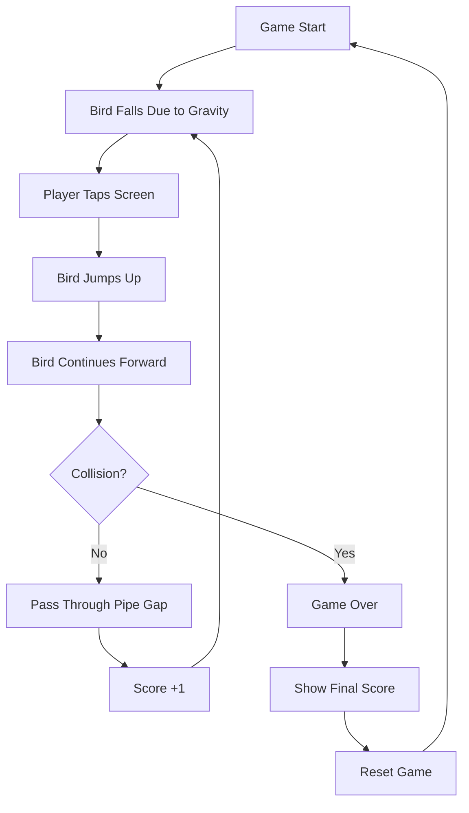
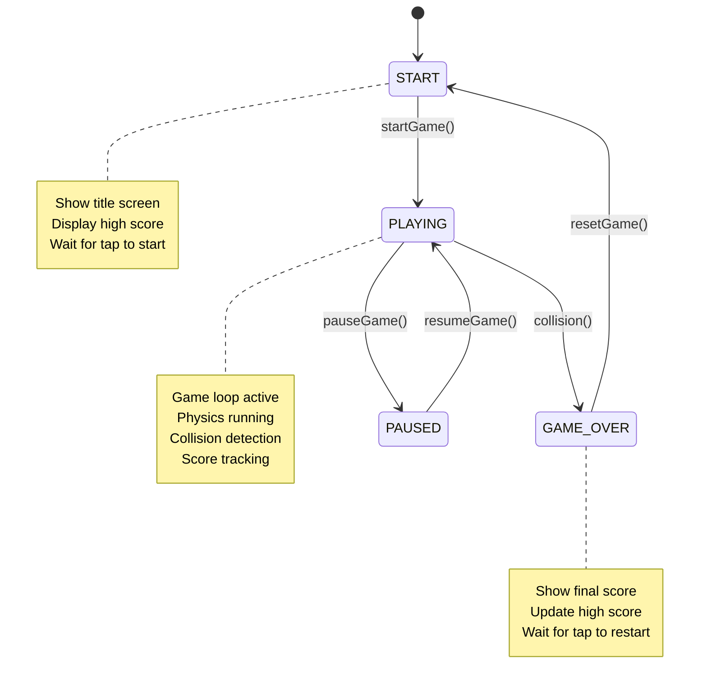

# Game Design

This document explains the game mechanics, physics systems, and design decisions behind Sky Dash. Understanding these concepts will help you modify gameplay, balance difficulty, and extend features.

## 📋 Table of Contents

- [Game Overview](#-game-overview)
- [Core Mechanics](#-core-mechanics)
- [Physics System](#-physics-system)
- [Collision Detection](#-collision-detection)
- [Scoring System](#-scoring-system)
- [Game States](#-game-states)
- [Difficulty and Balance](#-difficulty-and-balance)
- [Visual Design](#-visual-design)
- [Audio Design](#-audio-design)
- [Customization Guide](#-customization-guide)

## 🎮 Game Overview

Sky Dash is a physics-based endless runner inspired by Flappy Bird. The player controls a bird that must navigate through gaps between pipe obstacles by tapping the screen to counteract gravity.

### Core Gameplay Loop



### Design Philosophy

1. **Simple Controls**: Single tap input for accessibility
2. **Physics-Based**: Realistic gravity and momentum
3. **Challenging but Fair**: Precise collision detection with forgiving hitboxes
4. **Immediate Feedback**: Clear visual and audio cues
5. **Endless Progression**: Increasing difficulty through speed and spacing

## ⚙️ Core Mechanics

### Bird Control

The bird is controlled through a simple tap-to-jump mechanism:

```typescript
const jump = useCallback(() => {
  if (gameState === 'PLAYING') {
    setBird(prevBird => ({
      ...prevBird,
      velocity: PHYSICS_CONFIG.JUMP_VELOCITY, // -8 pixels/frame
      rotation: -20, // Tilt upward when jumping
    }));
  }
}, [gameState]);
```

**Design Decisions:**
- **Single Input**: Tap anywhere on screen for accessibility
- **Immediate Response**: No input delay for precise control
- **Visual Feedback**: Bird tilts up when jumping, down when falling

### Obstacle Generation

Pipes are generated procedurally with random gap positions:

```typescript
export const generateRandomPipeHeight = (): {
  topHeight: number;
  bottomHeight: number;
} => {
  const minGapY = SCREEN_HEIGHT * 0.2; // 20% from top
  const maxGapY = SCREEN_HEIGHT * 0.8; // 80% from top
  const gapY = Math.random() * (maxGapY - minGapY) + minGapY;

  return {
    topHeight: gapY - PHYSICS_CONFIG.PIPE_GAP / 2,
    bottomHeight: SCREEN_HEIGHT - gapY - PHYSICS_CONFIG.PIPE_GAP / 2 - GROUND_HEIGHT,
  };
};
```

**Design Decisions:**
- **Random Placement**: Gap position varies between 20%-80% of screen height
- **Consistent Gap Size**: 200px gap ensures consistent difficulty
- **Predictable Spacing**: New pipes generated every 180px for rhythm

## 🔬 Physics System

### Gravity and Movement

The physics system simulates realistic bird movement:

```typescript
const updateBird = useCallback(() => {
  setBird(prevBird => {
    // Apply gravity
    let newVelocity = prevBird.velocity + PHYSICS_CONFIG.GRAVITY;
    newVelocity = Math.min(newVelocity, PHYSICS_CONFIG.TERMINAL_VELOCITY);
    
    // Update position
    const newY = prevBird.y + newVelocity;
    
    // Calculate rotation based on velocity
    const newRotation = calculateBirdRotation(newVelocity);
    
    return {
      ...prevBird,
      y: newY,
      velocity: newVelocity,
      rotation: newRotation,
    };
  });
}, []);
```

### Physics Constants

```typescript
export const PHYSICS_CONFIG: PhysicsConfig = {
  GRAVITY: 0.5,              // Downward acceleration per frame
  JUMP_VELOCITY: -8,         // Upward velocity on jump
  TERMINAL_VELOCITY: 10,     // Maximum fall speed
  PIPE_SPEED: 2,             // Horizontal pipe movement
  PIPE_GAP: 200,             // Vertical gap between pipes
  BIRD_SIZE: { width: 32, height: 24 },
  PIPE_WIDTH: 52,
};
```

### Physics Tuning Guide

#### Gravity (0.5)
- **Lower values (0.3-0.4)**: Floatier, easier gameplay
- **Higher values (0.6-0.8)**: More challenging, faster falling
- **Impact**: Affects how quickly bird falls and jump timing

#### Jump Velocity (-8)
- **Less negative (-6 to -7)**: Shorter jumps, more taps needed
- **More negative (-9 to -12)**: Higher jumps, easier to overshoot
- **Impact**: Controls jump height and player input frequency

#### Terminal Velocity (10)
- **Lower values (6-8)**: Slower maximum fall speed
- **Higher values (12-15)**: Faster falling, more challenging
- **Impact**: Affects difficulty of recovery from mistakes

#### Pipe Speed (2)
- **Slower (1-1.5)**: Easier timing, more forgiving
- **Faster (2.5-4)**: Increased difficulty, faster reactions needed
- **Impact**: Overall game speed and difficulty progression

### Bird Rotation System

The bird rotates based on velocity for realistic movement:

```typescript
export const calculateBirdRotation = (velocity: number): number => {
  return Math.min(Math.max(velocity * 3, -20), 45);
};
```

**Rotation Behavior:**
- **Upward velocity**: Bird tilts up (max -20°)
- **Downward velocity**: Bird tilts down (max 45°)
- **Multiplier (3)**: Controls rotation sensitivity

## 🎯 Collision Detection

### AABB Collision System

The game uses Axis-Aligned Bounding Box (AABB) collision detection:

```typescript
export const checkAABBCollision = (
  box1: CollisionBox,
  box2: CollisionBox
): boolean => {
  return (
    box1.x < box2.x + box2.width &&
    box1.x + box1.width > box2.x &&
    box1.y < box2.y + box2.height &&
    box1.y + box1.height > box2.y
  );
};
```

### Forgiving Hitboxes

The bird's collision box is slightly smaller than its visual representation:

```typescript
export const getBirdCollisionBox = (bird: BirdState): CollisionBox => {
  const padding = 2; // 2px padding for forgiveness
  return createCollisionBox(
    bird.x + padding,
    bird.y + padding,
    PHYSICS_CONFIG.BIRD_SIZE.width - padding * 2,
    PHYSICS_CONFIG.BIRD_SIZE.height - padding * 2
  );
};
```

**Design Decisions:**
- **Forgiving Hitboxes**: 2px padding makes gameplay less frustrating
- **Visual vs. Collision**: Collision box smaller than sprite
- **Precise Detection**: AABB provides accurate, fast collision detection

### Collision Types

1. **Pipe Collision**: Bird hits top or bottom pipe segments
2. **Ground Collision**: Bird hits the ground
3. **Ceiling Collision**: Bird hits the top of the screen
4. **Scoring Collision**: Bird passes through pipe gap (positive collision)

## 🏆 Scoring System

### Score Mechanics

```typescript
const updateScore = useCallback(() => {
  setPipes(prevPipes => {
    let newScore = score;
    const updatedPipes = prevPipes.map(pipe => {
      if (checkBirdPassedPipe(bird, pipe)) {
        pipe.passed = true;
        newScore += 1;
      }
      return pipe;
    });

    if (newScore !== score) {
      setScore(newScore);
    }

    return updatedPipes;
  });
}, [bird, score]);
```

### Scoring Rules

1. **+1 Point**: For each pipe successfully passed
2. **Pass Detection**: When bird's left edge crosses pipe's right edge
3. **No Double Counting**: Pipes marked as "passed" to prevent multiple scores
4. **High Score Persistence**: Best score saved using AsyncStorage

### Score Display Design

```typescript
// Current score during gameplay
{gameState === 'PLAYING' && (
  <View style={styles.scoreContainer}>
    <ScoreDisplay score={score} />
  </View>
)}

// Final score with high score comparison
{gameState === 'GAME_OVER' && (
  <View style={styles.finalScoreContainer}>
    <Text style={styles.finalScoreValue}>{score}</Text>
    {score > 0 && score === highScore && (
      <Text style={styles.newRecordText}>New Record!</Text>
    )}
    <Text style={styles.bestScoreText}>Best: {highScore}</Text>
  </View>
)}
```

## 🔄 Game States

### State Machine



### State Transitions

```typescript
export type GameState = 'START' | 'PLAYING' | 'GAME_OVER' | 'PAUSED';

const handleScreenPress = () => {
  if (gameState === 'START') {
    startGame();
  } else if (gameState === 'PLAYING') {
    jump();
  } else if (gameState === 'GAME_OVER') {
    resetGame();
  }
};
```

### State-Specific Behavior

#### START State
- Display title and instructions
- Show current high score
- Initialize game objects
- Wait for user input

#### PLAYING State
- Run 60 FPS game loop
- Process physics updates
- Handle collision detection
- Update score
- Respond to tap input

#### GAME_OVER State
- Stop game loop
- Display final score
- Check for new high score
- Show restart prompt

#### PAUSED State (Optional)
- Pause game loop
- Maintain current state
- Show pause overlay

## ⚖️ Difficulty and Balance

### Difficulty Curve

The game maintains consistent difficulty through:

1. **Constant Pipe Speed**: Steady 2 pixels/frame movement
2. **Fixed Gap Size**: 200px gap remains constant
3. **Predictable Physics**: Consistent gravity and jump mechanics
4. **Random Variation**: Gap position provides variety without changing difficulty

### Balance Considerations

#### Accessibility
- **Forgiving Hitboxes**: 2px padding reduces frustration
- **Clear Visual Feedback**: Bird rotation indicates movement direction
- **Immediate Response**: No input lag for precise control

#### Challenge
- **Precise Timing**: Requires rhythm and timing skills
- **Momentum Management**: Players must manage bird's velocity
- **Endless Progression**: No maximum score limit

#### Fairness
- **Consistent Rules**: Physics never change during gameplay
- **Predictable Obstacles**: Pipe generation follows clear patterns
- **No Random Deaths**: All collisions are player's fault

### Difficulty Modification

To adjust difficulty, modify these values:

```typescript
// Easier gameplay
const EASY_PHYSICS = {
  ...PHYSICS_CONFIG,
  GRAVITY: 0.3,        // Slower falling
  JUMP_VELOCITY: -6,   // Shorter jumps
  PIPE_SPEED: 1.5,     // Slower pipes
  PIPE_GAP: 250,       // Larger gap
};

// Harder gameplay
const HARD_PHYSICS = {
  ...PHYSICS_CONFIG,
  GRAVITY: 0.7,        // Faster falling
  JUMP_VELOCITY: -10,  // Higher jumps
  PIPE_SPEED: 3,       // Faster pipes
  PIPE_GAP: 150,       // Smaller gap
};
```

## 🎨 Visual Design

### Color Palette

```typescript
const GAME_COLORS = {
  // Sky and background
  SKY_BLUE: '#87CEEB',
  CLOUD_WHITE: 'rgba(255, 255, 255, 0.3)',
  
  // Bird colors
  BIRD_BODY: '#FFD700',    // Gold
  BIRD_WING: '#FF8C00',    // Dark orange
  BIRD_EYE: '#000000',     // Black
  
  // Pipe colors
  PIPE_GREEN: '#4CAF50',   // Green
  PIPE_DARK: '#2E7D32',    // Dark green
  
  // Ground
  GROUND_BROWN: '#8B4513', // Saddle brown
  
  // UI colors
  SCORE_GOLD: '#FFD700',   // Gold
  TITLE_GOLD: '#FFD700',   // Gold
  GAME_OVER_RED: '#FF6B6B', // Red
};
```

### Visual Hierarchy

1. **Bird**: Most prominent, bright gold color
2. **Pipes**: High contrast green for clear obstacles
3. **Score**: Large, readable gold text
4. **Background**: Subtle sky blue, doesn't distract
5. **Ground**: Clear boundary, earthy brown

### Animation Principles

```typescript
// Smooth bird rotation
const animatedStyle = {
  transform: [
    { translateX: bird.x },
    { translateY: bird.y },
    { rotate: `${bird.rotation}deg` },
  ],
};

// Use native driver for performance
Animated.timing(animatedValue, {
  toValue: 1,
  duration: 300,
  useNativeDriver: true,
}).start();
```

## 🔊 Audio Design

### Sound Categories

1. **Jump Sound**: Played when bird jumps
2. **Score Sound**: Played when passing through pipes
3. **Collision Sound**: Played on game over
4. **Background Music**: Optional ambient music

### Audio Implementation

```typescript
// Example audio integration
import Sound from 'react-native-sound';

const jumpSound = new Sound('jump.mp3', Sound.MAIN_BUNDLE);
const scoreSound = new Sound('score.mp3', Sound.MAIN_BUNDLE);
const gameOverSound = new Sound('gameover.mp3', Sound.MAIN_BUNDLE);

const playJumpSound = () => {
  jumpSound.play();
};

const playScoreSound = () => {
  scoreSound.play();
};
```

### Audio Guidelines

- **Short Duration**: Keep sounds under 1 second
- **Clear Feedback**: Each action should have distinct audio
- **Volume Balance**: Ensure sounds don't overpower each other
- **Optional**: Allow players to disable audio

## 🛠️ Customization Guide

### Modifying Physics

```typescript
// Create custom physics configuration
const CUSTOM_PHYSICS = {
  ...PHYSICS_CONFIG,
  GRAVITY: 0.4,           // Adjust gravity
  JUMP_VELOCITY: -7,      // Adjust jump strength
  PIPE_SPEED: 2.5,        // Adjust game speed
  PIPE_GAP: 180,          // Adjust difficulty
};

// Apply in useGamePhysics hook
const updateBird = useCallback(() => {
  setBird(prevBird => {
    let newVelocity = prevBird.velocity + CUSTOM_PHYSICS.GRAVITY;
    // ... rest of physics logic
  });
}, []);
```

### Adding Power-ups

```typescript
// Extend game state for power-ups
interface ExtendedGameState extends GameStateInterface {
  powerUps: PowerUpState[];
  activePowerUps: ActivePowerUp[];
}

interface PowerUpState {
  id: string;
  type: 'SLOW_TIME' | 'SHIELD' | 'DOUBLE_SCORE';
  x: number;
  y: number;
  collected: boolean;
}

// Power-up effects
const applyPowerUp = (type: string) => {
  switch (type) {
    case 'SLOW_TIME':
      // Temporarily reduce pipe speed
      break;
    case 'SHIELD':
      // Ignore next collision
      break;
    case 'DOUBLE_SCORE':
      // Double score for limited time
      break;
  }
};
```

### Custom Themes

```typescript
// Theme system
interface GameTheme {
  colors: {
    sky: string;
    bird: string;
    pipes: string;
    ground: string;
  };
  sounds: {
    jump: string;
    score: string;
    gameOver: string;
  };
}

const NIGHT_THEME: GameTheme = {
  colors: {
    sky: '#1a1a2e',
    bird: '#ffd700',
    pipes: '#16213e',
    ground: '#0f3460',
  },
  sounds: {
    jump: 'night_jump.mp3',
    score: 'night_score.mp3',
    gameOver: 'night_gameover.mp3',
  },
};
```

### Adding Game Modes

```typescript
// Game mode system
type GameMode = 'CLASSIC' | 'SPEED' | 'PRECISION' | 'ENDLESS';

const GAME_MODE_CONFIGS = {
  CLASSIC: PHYSICS_CONFIG,
  SPEED: { ...PHYSICS_CONFIG, PIPE_SPEED: 4 },
  PRECISION: { ...PHYSICS_CONFIG, PIPE_GAP: 120 },
  ENDLESS: { ...PHYSICS_CONFIG, /* gradually increase difficulty */ },
};

// Dynamic difficulty in endless mode
const updateDifficulty = (score: number) => {
  const spee