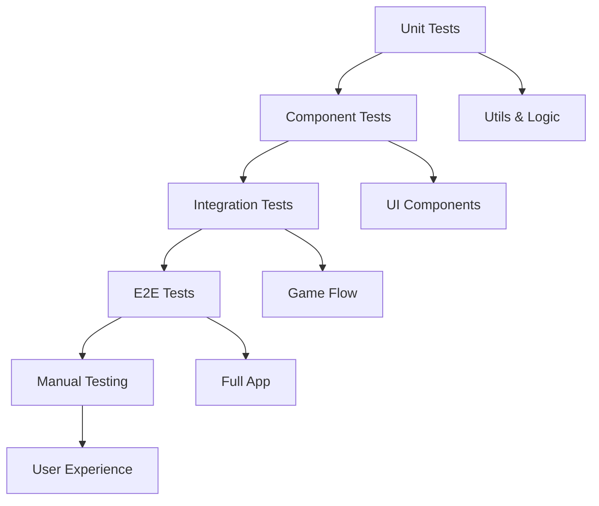

# Testing

This guide covers testing strategies, unit tests, integration tests, and debugging techniques for Sky Dash. Comprehensive testing ensures code quality, prevents regressions, and maintains game stability.

## 📋 Table of Contents

- [Testing Overview](#-testing-overview)
- [Unit Testing](#-unit-testing)
- [Component Testing](#-component-testing)
- [Integration Testing](#-integration-testing)
- [Game Logic Testing](#-game-logic-testing)
- [Performance Testing](#-performance-testing)
- [Manual Testing](#-manual-testing)
- [Debugging Strategies](#-debugging-strategies)
- [Testing Tools and Setup](#-testing-tools-and-setup)

## 🎯 Testing Overview

### Testing Strategy

Sky Dash uses a multi-layered testing approach:



### Testing Pyramid

| Test Type | Coverage | Speed | Cost | Purpose |
|-----------|----------|-------|------|---------|
| **Unit Tests** | 70% | Fast | Low | Individual functions |
| **Component Tests** | 20% | Medium | Medium | UI components |
| **Integration Tests** | 8% | Slow | High | Feature workflows |
| **E2E Tests** | 2% | Slowest | Highest | Complete user flows |

### Test Configuration

**File:** [`jest.config.js`](../jest.config.js)

```javascript
module.exports = {
  preset: 'react-native',
  setupFilesAfterEnv: ['<rootDir>/src/__tests__/setup.ts'],
  testMatch: [
    '**/__tests__/**/*.(ts|tsx|js)',
    '**/*.(test|spec).(ts|tsx|js)',
  ],
  collectCoverageFrom: [
    'src/**/*.{ts,tsx}',
    '!src/**/*.d.ts',
    '!src/__tests__/**',
  ],
  coverageThreshold: {
    global: {
      branches: 80,
      functions: 80,
      lines: 80,
      statements: 80,
    },
  },
  moduleNameMapping: {
    '^@/(.*)$': '<rootDir>/src/$1',
  },
};
```

## 🧪 Unit Testing

### Testing Utilities

**File:** [`src/utils/__tests__/physics.test.ts`](../src/utils/__tests__/physics.test.ts)

```typescript
import {
  calculateBirdRotation,
  generateRandomPipeHeight,
  isOffScreen,
  shouldGenerateNewPipe,
  PHYSICS_CONFIG,
  SCREEN_DIMENSIONS,
} from '../physics';

describe('Physics Utils', () => {
  describe('calculateBirdRotation', () => {
    it('should return -20 for negative velocity', () => {
      expect(calculateBirdRotation(-10)).toBe(-20);
    });

    it('should return 45 for high positive velocity', () => {
      expect(calculateBirdRotation(20)).toBe(45);
    });

    it('should scale velocity correctly', () => {
      expect(calculateBirdRotation(5)).toBe(15);
    });

    it('should handle zero velocity', () => {
      expect(calculateBirdRotation(0)).toBe(0);
    });

    it('should clamp rotation within bounds', () => {
      expect(calculateBirdRotation(-100)).toBe(-20);
      expect(calculateBirdRotation(100)).toBe(45);
    });
  });

  describe('generateRandomPipeHeight', () => {
    it('should generate valid pipe heights', () => {
      const { topHeight, bottomHeight } = generateRandomPipeHeight();
      
      expect(topHeight).toBeGreaterThan(0);
      expect(bottomHeight).toBeGreaterThan(0);
      expect(topHeight + bottomHeight + PHYSICS_CONFIG.PIPE_GAP)
        .toBeLessThanOrEqual(SCREEN_DIMENSIONS.HEIGHT - SCREEN_DIMENSIONS.GROUND_HEIGHT);
    });

    it('should generate different heights on multiple calls', () => {
      const heights1 = generateRandomPipeHeight();
      const heights2 = generateRandomPipeHeight();
      
      // Very unlikely to be exactly the same
      expect(heights1.topHeight).not.toBe(heights2.topHeight);
    });

    it('should maintain consistent gap size', () => {
      const { topHeight, bottomHeight } = generateRandomPipeHeight();
      const totalUsedHeight = topHeight + bottomHeight + SCREEN_DIMENSIONS.GROUND_HEIGHT;
      const gapSize = SCREEN_DIMENSIONS.HEIGHT - totalUsedHeight;
      
      expect(gapSize).toBe(PHYSICS_CONFIG.PIPE_GAP);
    });
  });

  describe('isOffScreen', () => {
    it('should return true for pipes off the left edge', () => {
      expect(isOffScreen(-PHYSICS_CONFIG.PIPE_WIDTH - 1)).toBe(true);
    });

    it('should return false for pipes still visible', () => {
      expect(isOffScreen(-PHYSICS_CONFIG.PIPE_WIDTH + 1)).toBe(false);
      expect(isOffScreen(0)).toBe(false);
      expect(isOffScreen(100)).toBe(false);
    });

    it('should handle edge case exactly at boundary', () => {
      expect(isOffScreen(-PHYSICS_CONFIG.PIPE_WIDTH)).toBe(false);
    });
  });

  describe('shouldGenerateNewPipe', () => {
    it('should return true when pipe is far enough from right edge', () => {
      expect(shouldGenerateNewPipe(SCREEN_DIMENSIONS.WIDTH - 200)).toBe(true);
    });

    it('should return false when pipe is too close to right edge', () => {
      expect(shouldGenerateNewPipe(SCREEN_DIMENSIONS.WIDTH - 100)).toBe(false);
    });

    it('should handle edge case at exact threshold', () => {
      expect(shouldGenerateNewPipe(SCREEN_DIMENSIONS.WIDTH - 180)).toBe(false);
    });
  });
});
```

### Testing Collision Detection

**File:** [`src/utils/__tests__/collision.test.ts`](../src/utils/__tests__/collision.test.ts)

```typescript
import {
  checkAABBCollision,
  getBirdCollisionBox,
  getPipeCollisionBoxes,
  checkBirdPipeCollision,
  checkBirdGroundCollision,
  checkBirdCeilingCollision,
  checkBirdPassedPipe,
} from '../collision';
import { BirdState, PipeState } from '../../types';
import { PHYSICS_CONFIG, SCREEN_DIMENSIONS } from '../physics';

describe('Collision Utils', () => {
  const mockBird: BirdState = {
    x: 100,
    y: 200,
    velocity: 0,
    rotation: 0,
  };

  const mockPipe: PipeState = {
    id: 'test-pipe',
    x: 150,
    topHeight: 100,
    bottomHeight: 150,
    passed: false,
  };

  describe('checkAABBCollision', () => {
    it('should detect overlapping boxes', () => {
      const box1 = { x: 0, y: 0, width: 50, height: 50 };
      const box2 = { x: 25, y: 25, width: 50, height: 50 };
      
      expect(checkAABBCollision(box1, box2)).toBe(true);
    });

    it('should not detect non-overlapping boxes', () => {
      const box1 = { x: 0, y: 0, width: 50, height: 50 };
      const box2 = { x: 60, y: 60, width: 50, height: 50 };
      
      expect(checkAABBCollision(box1, box2)).toBe(false);
    });

    it('should handle touching boxes correctly', () => {
      const box1 = { x: 0, y: 0, width: 50, height: 50 };
      const box2 = { x: 50, y: 0, width: 50, height: 50 };
      
      expect(checkAABBCollision(box1, box2)).toBe(false);
    });
  });

  describe('getBirdCollisionBox', () => {
    it('should create collision box with padding', () => {
      const collisionBox = getBirdCollisionBox(mockBird);
      
      expect(collisionBox.x).toBe(mockBird.x + 2);
      expect(collisionBox.y).toBe(mockBird.y + 2);
      expect(collisionBox.width).toBe(PHYSICS_CONFIG.BIRD_SIZE.width - 4);
      expect(collisionBox.height).toBe(PHYSICS_CONFIG.BIRD_SIZE.height - 4);
    });
  });

  describe('checkBirdPipeCollision', () => {
    it('should detect collision with top pipe', () => {
      const birdInTopPipe: BirdState = {
        ...mockBird,
        x: 160,
        y: 50, // Inside top pipe
      };
      
      expect(checkBirdPipeCollision(birdInTopPipe, mockPipe)).toBe(true);
    });

    it('should detect collision with bottom pipe', () => {
      const birdInBottomPipe: BirdState = {
        ...mockBird,
        x: 160,
        y: SCREEN_DIMENSIONS.HEIGHT - 100, // Inside bottom pipe
      };
      
      expect(checkBirdPipeCollision(birdInBottomPipe, mockPipe)).toBe(true);
    });

    it('should not detect collision in gap', () => {
      const birdInGap: BirdState = {
        ...mockBird,
        x: 160,
        y: 300, // In the gap between pipes
      };
      
      expect(checkBirdPipeCollision(birdInGap, mockPipe)).toBe(false);
    });

    it('should not detect collision when bird is not horizontally aligned', () => {
      const birdNotAligned: BirdState = {
        ...mockBird,
        x: 50, // Before pipe
        y: 50,
      };
      
      expect(checkBirdPipeCollision(birdNotAligned, mockPipe)).toBe(false);
    });
  });

  describe('checkBirdGroundCollision', () => {
    it('should detect ground collision', () => {
      const birdOnGround: BirdState = {
        ...mockBird,
        y: SCREEN_DIMENSIONS.HEIGHT - SCREEN_DIMENSIONS.GROUND_HEIGHT,
      };
      
      expect(checkBirdGroundCollision(birdOnGround)).toBe(true);
    });

    it('should not detect collision when bird is above ground', () => {
      const birdAboveGround: BirdState = {
        ...mockBird,
        y: SCREEN_DIMENSIONS.HEIGHT - SCREEN_DIMENSIONS.GROUND_HEIGHT - 50,
      };
      
      expect(checkBirdGroundCollision(birdAboveGround)).toBe(false);
    });
  });

  describe('checkBirdCeilingCollision', () => {
    it('should detect ceiling collision', () => {
      const birdAtCeiling: BirdState = {
        ...mockBird,
        y: -1,
      };
      
      expect(checkBirdCeilingCollision(birdAtCeiling)).toBe(true);
    });

    it('should not detect collision when bird is below ceiling', () => {
      expect(checkBirdCeilingCollision(mockBird)).toBe(false);
    });
  });

  describe('checkBirdPassedPipe', () => {
    it('should detect when bird has passed pipe', () => {
      const birdPastPipe: BirdState = {
        ...mockBird,
        x: mockPipe.x + PHYSICS_CONFIG.PIPE_WIDTH + 1,
      };
      
      expect(checkBirdPassedPipe(birdPastPipe, mockPipe)).toBe(true);
    });

    it('should not detect passing if pipe already marked as passed', () => {
      const passedPipe: PipeState = {
        ...mockPipe,
        passed: true,
      };
      
      const birdPastPipe: BirdState = {
        ...mockBird,
        x: mockPipe.x + PHYSICS_CONFIG.PIPE_WIDTH + 1,
      };
      
      expect(checkBirdPassedPipe(birdPastPipe, passedPipe)).toBe(false);
    });

    it('should not detect passing when bird has not reached pipe', () => {
      const birdBeforePipe: BirdState = {
        ...mockBird,
        x: mockPipe.x - 10,
      };
      
      expect(checkBirdPassedPipe(birdBeforePipe, mockPipe)).toBe(false);
    });
  });
});
```

### Testing Storage

**File:** [`src/utils/__tests__/storage.test.ts`](../src/utils/__tests__/storage.test.ts)

```typescript
import AsyncStorage from '@react-native-async-storage/async-storage';
import { getHighScore, updateHighScore } from '../storage';

// Mock AsyncStorage
jest.mock('@react-native-async-storage/async-storage', () => ({
  getItem: jest.fn(),
  setItem: jest.fn(),
}));

const mockAsyncStorage = AsyncStorage as jest.Mocked<typeof AsyncStorage>;

describe('Storage Utils', () => {
  beforeEach(() => {
    jest.clearAllMocks();
  });

  describe('getHighScore', () => {
    it('should return stored high score', async () => {
      mockAsyncStorage.getItem.mockResolvedValue('42');
      
      const highScore = await getHighScore();
      
      expect(highScore).toBe(42);
      expect(mockAsyncStorage.getItem).toHaveBeenCalledWith('HIGH_SCORE');
    });

    it('should return 0 when no score is stored', async () => {
      mockAsyncStorage.getItem.mockResolvedValue(null);
      
      const highScore = await getHighScore();
      
      expect(highScore).toBe(0);
    });

    it('should return 0 when storage throws error', async () => {
      mockAsyncStorage.getItem.mockRejectedValue(new Error('Storage error'));
      
      const highScore = await getHighScore();
      
      expect(highScore).toBe(0);
    });

    it('should handle invalid stored value', async () => {
      mockAsyncStorage.getItem.mockResolvedValue('invalid');
      
      const highScore = await getHighScore();
      
      expect(highScore).toBe(0); // parseInt('invalid') returns NaN, should default to 0
    });
  });

  describe('updateHighScore', () => {
    it('should update high score when new score is higher', async () => {
      mockAsyncStorage.getItem.mockResolvedValue('10');
      mockAsyncStorage.setItem.mockResolvedValue();
      
      const result = await updateHighScore(20);
      
      expect(result).toBe(20);
      expect(mockAsyncStorage.setItem).toHaveBeenCalledWith('HIGH_SCORE', '20');
    });

    it('should not update when new score is lower', async () => {
      mockAsyncStorage.getItem.mockResolvedValue('30');
      
      const result = await updateHighScore(20);
      
      expect(result).toBe(30);
      expect(mockAsyncStorage.setItem).not.toHaveBeenCalled();
    });

    it('should handle storage errors gracefully', async () => {
      mockAsyncStorage.getItem.mockResolvedValue('10');
      mockAsyncStorage.setItem.mockRejectedValue(new Error('Storage error'));
      
      const result = await updateHighScore(20);
      
      expect(result).toBe(10); // Should return current high score on error
    });
  });
});
```

## 🧩 Component Testing

### Testing React Components

**File:** [`src/components/__tests__/Bird.test.tsx`](../src/components/__tests__/Bird.test.tsx)

```typescript
import React from 'react';
import { render } from '@testing-library/react-native';
import Bird from '../Bird';
import { BirdState } from '../../types';

describe('Bird Component', () => {
  const mockBird: BirdState = {
    x: 100,
    y: 200,
    velocity: 0,
    rotation: 0,
  };

  it('should render without crashing', () => {
    const { getByTestId } = render(<Bird bird={mockBird} />);
    expect(getByTestId('bird')).toBeTruthy();
  });

  it('should apply correct transform styles', () => {
    const { getByTestId } = render(<Bird bird={mockBird} />);
    const birdElement = getByTestId('bird');
    
    expect(birdElement.props.style).toEqual(
      expect.arrayContaining([
        expect.objectContaining({
          transform: [
            { translateX: 100 },
            { translateY: 200 },
            { rotate: '0deg' },
          ],
        }),
      ])
    );
  });

  it('should update position when bird state changes', () => {
    const { getByTestId, rerender } = render(<Bird bird={mockBird} />);
    
    const updatedBird: BirdState = {
      ...mockBird,
      x: 150,
      y: 250,
      rotation: -20,
    };
    
    rerender(<Bird bird={updatedBird} />);
    
    const birdElement = getByTestId('bird');
    expect(birdElement.props.style).toEqual(
      expect.arrayContaining([
        expect.objectContaining({
          transform: [
            { translateX: 150 },
            { translateY: 250 },
            { rotate: '-20deg' },
          ],
        }),
      ])
    );
  });

  it('should render bird body, wing, and eye', () => {
    const { getByTestId } = render(<Bird bird={mockBird} />);
    
    expect(getByTestId('bird-body')).toBeTruthy();
    expect(getByTestId('bird-wing')).toBeTruthy();
    expect(getByTestId('bird-eye')).toBeTruthy();
  });
});
```

### Testing Score Display

**File:** [`src/components/__tests__/ScoreDisplay.test.tsx`](../src/components/__tests__/ScoreDisplay.test.tsx)

```typescript
import React from 'react';
import { render } from '@testing-library/react-native';
import ScoreDisplay from '../ScoreDisplay';

describe('ScoreDisplay Component', () => {
  it('should display current score', () => {
    const { getByText } = render(<ScoreDisplay score={42} />);
    expect(getByText('42')).toBeTruthy();
  });

  it('should display high score when showHighScore is true', () => {
    const { getByText } = render(
      <ScoreDisplay score={10} highScore={50} showHighScore={true} />
    );
    
    expect(getByText('10')).toBeTruthy();
    expect(getByText('Best: 50')).toBeTruthy();
  });

  it('should not display high score when showHighScore is false', () => {
    const { queryByText } = render(
      <ScoreDisplay score={10} highScore={50} showHighScore={false} />
    );
    
    expect(queryByText('Best: 50')).toBeNull();
  });

  it('should handle zero score', () => {
    const { getByText } = render(<ScoreDisplay score={0} />);
    expect(getByText('0')).toBeTruthy();
  });

  it('should handle large scores', () => {
    const { getByText } = render(<ScoreDisplay score={9999} />);
    expect(getByText('9999')).toBeTruthy();
  });
});
```

## 🔗 Integration Testing

### Testing Game Hook

**File:** [`src/hooks/__tests__/useGamePhysics.test.ts`](../src/hooks/__tests__/useGamePhysics.test.ts)

```typescript
import { renderHook, act } from '@testing-library/react-hooks';
import { useGamePhysics } from '../useGamePhysics';
import * as storage from '../../utils/storage';

// Mock storage functions
jest.mock('../../utils/storage', () => ({
  getHighScore: jest.fn(),
  updateHighScore: jest.fn(),
}));

const mockStorage = storage as jest.Mocked<typeof storage>;

describe('useGamePhysics Hook', () => {
  beforeEach(() => {
    jest.clearAllMocks();
    mockStorage.getHighScore.mockResolvedValue(0);
    mockStorage.updateHighScore.mockImplementation(async (score) => score);
  });

  it('should initialize with correct default state', async () => {
    const { result, waitForNextUpdate } = renderHook(() => useGamePhysics());
    
    await waitForNextUpdate(); // Wait for high score to load
    
    expect(result.current.gameState).toBe('START');
    expect(result.current.score).toBe(0);
    expect(result.current.bird.x).toBe(expect.any(Number));
    expect(result.current.bird.y).toBe(expect.any(Number));
    expect(result.current.pipes).toEqual([]);
  });

  it('should start game when startGame is called', async () => {
    const { result, waitForNextUpdate } = renderHook(() => useGamePhysics());
    
    await waitForNextUpdate();
    
    act(() => {
      result.current.startGame();
    });
    
    expect(result.current.gameState).toBe('PLAYING');
    expect(result.current.pipes.length).toBeGreaterThan(0);
  });

  it('should make bird jump when jump is called during gameplay', async () => {
    const { result, waitForNextUpdate } = renderHook(() => useGamePhysics());
    
    await waitForNextUpdate();
    
    act(() => {
      result.current.startGame();
    });
    
    const initialVelocity = result.current.bird.velocity;
    
    act(() => {
      result.current.jump();
    });
    
    expect(result.current.bird.velocity).toBeLessThan(initialVelocity);
    expect(result.current.bird.rotation).toBe(-20);
  });

  it('should not jump when game is not playing', async () => {
    const { result, waitForNextUpdate } = renderHook(() => useGamePhysics());
    
    await waitForNextUpdate();
    
    const initialVelocity = result.current.bird.velocity;
    
    act(() => {
      result.current.jump(); // Try to jump in START state
    });
    
    expect(result.current.bird.velocity).toBe(initialVelocity);
  });

  it('should reset game state when resetGame is called', async () => {
    const { result, waitForNextUpdate } = renderHook(() => useGamePhysics());
    
    await waitForNextUpdate();
    
    // Start game and modify state
    act(() => {
      result.current.startGame();
    });
    
    // Simulate some gameplay
    act(() => {
      result.current.jump();
    });
    
    // Reset game
    await act(async () => {
      await result.current.resetGame();
    });
    
    expect(result.current.gameState).toBe('START');
    expect(result.current.score).toBe(0);
    expect(result.current.pipes).toEqual([]);
  });

  it('should update high score when game is reset with higher score', async () => {
    mockStorage.getHighScore.mockResolvedValue(10);
    mockStorage.updateHighScore.mockResolvedValue(20);
    
    const { result, waitForNextUpdate } = renderHook(() => useGamePhysics());
    
    await waitForNextUpdate();
    
    // Manually set a higher score
    act(() => {
      // This would normally happen through gameplay
      result.current.startGame();
    });
    
    // Simulate achieving a score of 20
    // In real implementation, this would happen through pipe passing
    
    await act(async () => {
      await result.current.resetGame();
    });
    
    expect(mockStorage.updateHighScore).toHaveBeenCalled();
  });
});
```

## 🎮 Game Logic Testing

### Testing Game Flow

**File:** [`src/__tests__/gameFlow.test.ts`](../src/__tests__/gameFlow.test.ts)

```typescript
import { renderHook, act } from '@testing-library/react-hooks';
import { useGamePhysics } from '../hooks/useGamePhysics';
import { PHYSICS_CONFIG } from '../utils/physics';

describe('Game Flow Integration', () => {
  beforeEach(() => {
    jest.useFakeTimers();
  });

  afterEach(() => {
    jest.useRealTimers();
  });

  it('should complete full game cycle', async () => {
    const { result, waitForNextUpdate } = renderHook(() => useGamePhysics());
    
    await waitForNextUpdate();
    
    // 1. Start in START state
    expect(result.current.gameState).toBe('START');
    
    // 2. Start game
    act(() => {
      result.current.startGame();
    });
    
    expect(result.current.gameState).toBe('PLAYING');
    
    // 3. Simulate gameplay - bird should fall due to gravity
    act(() => {
      jest.advanceTimersByTime(100); // Advance game loop
    });
    
    // Bird should have moved due to physics
    expect(result.current.bird.velocity).toBeGreaterThan(0);
    
    // 4. Make bird jump
    act(() => {
      result.current.jump();
    });
    
    expect(result.current.bird.velocity).toBe(PHYSICS_CONFIG.JUMP_VELOCITY);
    
    // 5. Reset game
    await act(async () => {
      await result.current.resetGame();
    });
    
    expect(result.current.gameState).toBe('START');
    expect(result.current.score).toBe(0);
  });

  it('should handle collision and game over', async () => {
    const { result, waitForNextUpdate } = renderHook(() => useGamePhysics());
    
    await waitForNextUpdate();
    
    act(() => {
      result.current.startGame();
    });
    
    // Simulate bird hitting ground by advancing time significantly
    act(() => {
      jest.advanceTimersByTime(5000); // Long enough for bird to fall to ground
    });
    
    // Game should be over due to ground collision
    expect(result.current.gameState).toBe('GAME_OVER');
  });
});
```

### Testing Physics Simulation

**File:** [`src/__tests__/physicsSimulation.test.ts`](../src/__tests__/physicsSimulation.test.ts)

```typescript
import { PHYSICS_CONFIG } from '../utils/physics';
import { calculateBirdRotation } from '../utils/physics';

describe('Physics Simulation', () => {
  it('should simulate realistic bird movement', () => {
    let birdY = 300;
    let velocity = 0;
    
    // Simulate 10 frames of falling
    for (let i = 0; i < 10; i++) {
      velocity += PHYSICS_CONFIG.GRAVITY;
      velocity = Math.min(velocity, PHYSICS_CONFIG.TERMINAL_VELOCITY);
      birdY += velocity;
    }
    
    expect(birdY).toBeGreaterThan(300); // Bird should have fallen
    expect(velocity).toBeGreaterThan(0); // Bird should have downward velocity
    expect(velocity).toBeLessThanOrEqual(PHYSICS_CONFIG.TERMINAL_VELOCITY);
  });

  it('should simulate jump mechanics', () => {
    let velocity = 5; // Bird falling
    
    // Apply jump
    velocity = PHYSICS_CONFIG.JUMP_VELOCITY;
    
    expect(velocity).toBe(-8); // Upward velocity
    
    // Simulate a few frames after jump
    for (let i = 0; i < 5; i++) {
      velocity += PHYSICS_CONFIG.GRAVITY;
    }
    
    expect(velocity).toBeLessThan(PHYSICS_CONFIG.JUMP_VELOCITY); // Velocity should increase (less negative)
  });

  it('should simulate rotation based on velocity', () => {
    // Test various velocities
    expect(calculateBirdRotation(-8)).toBe(-20); // Jumping up
    expect(calculateBirdRotation(0)).toBe(0);    // Neutral
    expect(calculateBirdRotation(5)).toBe(15);   // Falling
    expect(calculateBirdRotation(15)).toBe(45);  // Fast fall
  });
});
```

## ⚡ Performance Testing

### Performance Test Suite

**File:** [`src/__tests__/performance.test.ts`](../src/__tests__/performance.test.ts)

```typescript
import { performance } from 'perf_hooks';
import { calculateBirdRotation, generateRandomPipeHeight } from '../utils/physics';
import { checkAABBCollision } from '../utils/collision';

describe('Performance Tests', () => {
  it('should calculate bird rotation efficiently', () => {
    const iterations = 10000;
    const start = performance.now();
    
    for (let i = 0; i < iterations; i++) {
      calculateBirdRotation(Math.random() * 20 - 10);
    }
    
    const end = performance.now();
    const timePerOperation = (end - start) / iterations;
    
    expect(timePerOperation).toBeLessThan(0.01); // Less than 0.01ms per operation
  });

  it('should generate pipe heights efficiently', () => {
    const iterations = 1000;
    const start = performance.now();
    
    for (let i = 0; i < iterations; i++) {
      generateRandomPipeHeight();
    }
    
    const end = performance.now();
    const timePerOperation = (end - start) / iterations;
    
    expect(timePerOperation).toBeLessThan(0.1); // Less than 0.1ms per operation
  });

  it('should perform collision detection efficiently', () => {
    const iterations = 10000;
    const box1 = { x: 0, y: 0, width: 32, height: 24 };
    const box2 = { x: 16, y: 12, width: 52, height: 400 };
    
    const start = performance.now();
    
    for (let i = 0; i < iterations; i++) {
      checkAABBCollision(box1, box2);
    }
    
    const end = performance.now();
    const timePerOperation = (end - start) / iterations;
    
    expect(timePerOperation).toBeLessThan(0.001); // Less than 0.001ms per operation
  });

  it('should handle memory efficiently in game loop simulation', () => {
    const initialMemory = process.memoryUsage().heapUsed;
    
    // Simulate 1000 game loop iterations
    for (let i = 0; i 
; i < 1000; i++) {
      // Simulate game operations that might create objects
      const bird = { x: i, y: i * 2, velocity: i % 10, rotation: i % 45 };
      const pipes = Array.from({ length: 3 }, (_, j) => ({
        id: `pipe_${i}_${j}`,
        x: i + j * 100,
        topHeight: Math.random() * 200,
        bottomHeight: Math.random() * 200,
        passed: false,
      }));
      
      // Simulate collision checks
      checkAABBCollision(
        { x: bird.x, y: bird.y, width: 32, height: 24 },
        { x: pipes[0].x, y: 0, width: 52, height: pipes[0].topHeight }
      );
    }
    
    const finalMemory = process.memoryUsage().heapUsed;
    const memoryIncrease = finalMemory - initialMemory;
    
    // Memory increase should be reasonable (less than 10MB for 1000 iterations)
    expect(memoryIncrease).toBeLessThan(10 * 1024 * 1024);
  });
});
```

## 📱 Manual Testing

### Manual Testing Checklist

#### Core Gameplay
- [ ] **Game Launch**: App starts without crashes
- [ ] **Title Screen**: Displays correctly with high score
- [ ] **Game Start**: Tap starts game, bird appears, pipes generate
- [ ] **Bird Control**: Tap makes bird jump with correct physics
- [ ] **Gravity**: Bird falls naturally when not tapping
- [ ] **Collision Detection**: Bird dies when hitting pipes, ground, or ceiling
- [ ] **Scoring**: Score increases when passing through pipe gaps
- [ ] **Game Over**: Shows final score and restart option
- [ ] **High Score**: Saves and displays correctly

#### Physics and Animation
- [ ] **Bird Rotation**: Bird tilts based on velocity
- [ ] **Smooth Movement**: 60 FPS gameplay without stuttering
- [ ] **Pipe Generation**: New pipes appear at correct intervals
- [ ] **Pipe Removal**: Off-screen pipes are cleaned up
- [ ] **Collision Accuracy**: Hitboxes feel fair and responsive

#### UI and Visual
- [ ] **Score Display**: Clear and readable during gameplay
- [ ] **Game States**: Proper transitions between START/PLAYING/GAME_OVER
- [ ] **Visual Feedback**: Clear indication of game state changes
- [ ] **Responsive Layout**: Works on different screen sizes
- [ ] **Performance**: No visual glitches or frame drops

#### Cross-Platform Testing
- [ ] **Android**: Works on various Android devices and versions
- [ ] **iOS**: Works on various iOS devices and versions
- [ ] **Performance**: Consistent performance across platforms
- [ ] **Storage**: High scores persist across app restarts

### Device Testing Matrix

| Device Type | Screen Size | OS Version | Performance | Notes |
|-------------|-------------|------------|-------------|-------|
| **iPhone 12** | 6.1" | iOS 15+ | ✅ Excellent | Reference device |
| **iPhone SE** | 4.7" | iOS 14+ | ✅ Good | Small screen test |
| **Samsung Galaxy S21** | 6.2" | Android 11+ | ✅ Excellent | High-end Android |
| **Google Pixel 4a** | 5.8" | Android 10+ | ✅ Good | Mid-range Android |
| **OnePlus 7T** | 6.55" | Android 10+ | ✅ Good | Performance test |

### Performance Testing

#### Frame Rate Testing
```typescript
// Manual FPS testing procedure
const testFrameRate = () => {
  let frameCount = 0;
  let startTime = Date.now();
  
  const countFrames = () => {
    frameCount++;
    requestAnimationFrame(countFrames);
    
    if (frameCount % 60 === 0) {
      const elapsed = Date.now() - startTime;
      const fps = (frameCount / elapsed) * 1000;
      console.log(`Current FPS: ${fps.toFixed(1)}`);
      
      if (fps < 50) {
        console.warn('Performance issue detected!');
      }
    }
  };
  
  requestAnimationFrame(countFrames);
};
```

#### Memory Testing
```typescript
// Memory usage monitoring
const monitorMemory = () => {
  setInterval(() => {
    // @ts-ignore - React Native specific
    if (global.performance?.memory) {
      const memory = global.performance.memory;
      const used = (memory.usedJSHeapSize / 1024 / 1024).toFixed(2);
      const total = (memory.totalJSHeapSize / 1024 / 1024).toFixed(2);
      
      console.log(`Memory: ${used}MB / ${total}MB`);
      
      if (memory.usedJSHeapSize > 100 * 1024 * 1024) {
        console.warn('High memory usage detected!');
      }
    }
  }, 5000);
};
```

## 🐛 Debugging Strategies

### React Native Debugging

#### 1. Metro Bundler Debugging
```bash
# Start with debugging enabled
npx react-native start --verbose

# Reset cache if needed
npx react-native start --reset-cache
```

#### 2. Chrome DevTools
```typescript
// Enable remote debugging
// In app: Shake device → Debug → Debug with Chrome

// Add breakpoints in Chrome DevTools
const gameLoop = () => {
  debugger; // Breakpoint will trigger in Chrome
  updateBird();
  updatePipes();
};
```

#### 3. React Native Debugger
```bash
# Install React Native Debugger
# Download from: https://github.com/jhen0409/react-native-debugger

# Enable in app
// Shake device → Debug → Debug with React Native Debugger
```

### Game-Specific Debugging

#### 1. Physics Debugging
```typescript
// Visual collision box debugging
const DebugCollisionBoxes: React.FC<{ bird: BirdState; pipes: PipeState[] }> = ({ bird, pipes }) => {
  if (!__DEV__) return null;
  
  const birdBox = getBirdCollisionBox(bird);
  
  return (
    <>
      {/* Bird collision box */}
      <View style={[styles.debugBox, {
        left: birdBox.x,
        top: birdBox.y,
        width: birdBox.width,
        height: birdBox.height,
        borderColor: 'red',
      }]} />
      
      {/* Pipe collision boxes */}
      {pipes.map(pipe => {
        const pipeBoxes = getPipeCollisionBoxes(pipe);
        return pipeBoxes.map((box, index) => (
          <View
            key={`${pipe.id}-${index}`}
            style={[styles.debugBox, {
              left: box.x,
              top: box.y,
              width: box.width,
              height: box.height,
              borderColor: 'blue',
            }]}
          />
        ));
      })}
    </>
  );
};

const styles = StyleSheet.create({
  debugBox: {
    position: 'absolute',
    borderWidth: 2,
    backgroundColor: 'transparent',
    zIndex: 100,
  },
});
```

#### 2. Game State Debugging
```typescript
// Game state logger
const useGameStateLogger = (gameState: any) => {
  useEffect(() => {
    if (__DEV__) {
      console.log('Game State Changed:', {
        gameState: gameState.gameState,
        score: gameState.score,
        birdPosition: { x: gameState.bird.x, y: gameState.bird.y },
        birdVelocity: gameState.bird.velocity,
        pipeCount: gameState.pipes.length,
        timestamp: new Date().toISOString(),
      });
    }
  }, [gameState]);
};
```

#### 3. Performance Debugging
```typescript
// Performance profiler
const usePerformanceProfiler = () => {
  const renderCount = useRef(0);
  const lastRenderTime = useRef(Date.now());
  
  useEffect(() => {
    if (__DEV__) {
      renderCount.current++;
      const now = Date.now();
      const timeSinceLastRender = now - lastRenderTime.current;
      
      if (timeSinceLastRender > 20) {
        console.warn(`Slow render detected: ${timeSinceLastRender}ms`);
      }
      
      lastRenderTime.current = now;
    }
  });
  
  return renderCount.current;
};
```

### Debugging Tools

#### 1. Flipper Integration
```bash
# Install Flipper
# Download from: https://fbflipper.com/

# Add Flipper plugins for React Native
npm install --save-dev react-native-flipper
```

#### 2. Reactotron Setup
```bash
# Install Reactotron
npm install --save-dev reactotron-react-native

# Configure Reactotron
// ReactotronConfig.ts
import Reactotron from 'reactotron-react-native';

if (__DEV__) {
  Reactotron
    .configure({ name: 'Sky Dash' })
    .useReactNative()
    .connect();
}
```

#### 3. Custom Debug Panel
```typescript
// Debug panel component
const DebugPanel: React.FC<{ gameState: any }> = ({ gameState }) => {
  if (!__DEV__) return null;
  
  return (
    <View style={styles.debugPanel}>
      <Text style={styles.debugText}>FPS: {/* FPS counter */}</Text>
      <Text style={styles.debugText}>State: {gameState.gameState}</Text>
      <Text style={styles.debugText}>Score: {gameState.score}</Text>
      <Text style={styles.debugText}>Bird Y: {gameState.bird.y.toFixed(1)}</Text>
      <Text style={styles.debugText}>Velocity: {gameState.bird.velocity.toFixed(1)}</Text>
      <Text style={styles.debugText}>Pipes: {gameState.pipes.length}</Text>
    </View>
  );
};
```

## 🛠️ Testing Tools and Setup

### Test Environment Setup

**File:** [`src/__tests__/setup.ts`](../src/__tests__/setup.ts)

```typescript
import 'react-native-gesture-handler/jestSetup';

// Mock React Native modules
jest.mock('react-native-reanimated', () => {
  const Reanimated = require('react-native-reanimated/mock');
  Reanimated.default.call = () => {};
  return Reanimated;
});

// Mock AsyncStorage
jest.mock('@react-native-async-storage/async-storage', () =>
  require('@react-native-async-storage/async-storage/jest/async-storage-mock')
);

// Mock React Native Sound
jest.mock('react-native-sound', () => {
  const Sound = jest.fn();
  Sound.prototype.play = jest.fn();
  Sound.prototype.stop = jest.fn();
  Sound.prototype.setVolume = jest.fn();
  Sound.setCategory = jest.fn();
  Sound.MAIN_BUNDLE = '';
  return Sound;
});

// Mock Dimensions
jest.mock('react-native/Libraries/Utilities/Dimensions', () => ({
  get: jest.fn().mockReturnValue({ width: 375, height: 667 }),
}));

// Silence console warnings in tests
global.console = {
  ...console,
  warn: jest.fn(),
  error: jest.fn(),
};

// Mock performance.now for consistent timing in tests
global.performance = {
  now: jest.fn(() => Date.now()),
} as any;
```

### Running Tests

```bash
# Run all tests
npm test

# Run tests in watch mode
npm test -- --watch

# Run tests with coverage
npm test -- --coverage

# Run specific test file
npm test -- physics.test.ts

# Run tests matching pattern
npm test -- --testNamePattern="collision"

# Run tests with verbose output
npm test -- --verbose
```

### Coverage Reports

```bash
# Generate coverage report
npm test -- --coverage --coverageDirectory=coverage

# View coverage in browser
open coverage/lcov-report/index.html
```

### Continuous Integration

**File:** [`.github/workflows/test.yml`](../.github/workflows/test.yml)

```yaml
name: Tests

on:
  push:
    branches: [ main, develop ]
  pull_request:
    branches: [ main ]

jobs:
  test:
    runs-on: ubuntu-latest
    
    steps:
    - uses: actions/checkout@v3
    
    - name: Setup Node.js
      uses: actions/setup-node@v3
      with:
        node-version: '18'
        cache: 'npm'
    
    - name: Install dependencies
      run: npm ci
    
    - name: Run linter
      run: npm run lint
    
    - name: Run tests
      run: npm test -- --coverage --watchAll=false
    
    - name: Upload coverage to Codecov
      uses: codecov/codecov-action@v3
      with:
        file: ./coverage/lcov.info
        flags: unittests
        name: codecov-umbrella
```

### Test Scripts

**File:** [`package.json`](../package.json) (test scripts section)

```json
{
  "scripts": {
    "test": "jest",
    "test:watch": "jest --watch",
    "test:coverage": "jest --coverage",
    "test:ci": "jest --coverage --watchAll=false",
    "test:debug": "jest --detectOpenHandles --forceExit",
    "test:update": "jest --updateSnapshot"
  }
}
```

---

**Ready to test?** Start with the [Getting Started](Getting-Started) guide to set up your environment, then explore the [Performance Optimization](Performance-Optimization) guide to ensure your tests run efficiently.