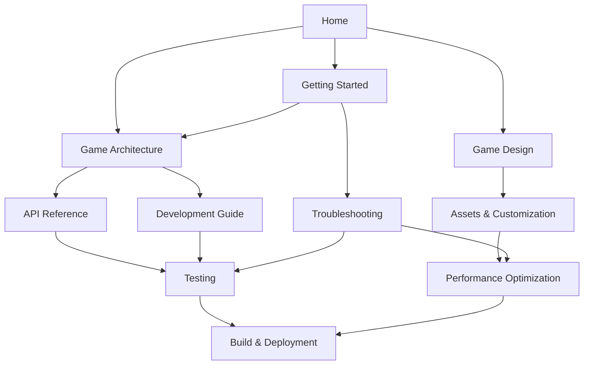

# Wiki Summary

This document provides a comprehensive overview of the Sky Dash wiki structure and content organization.

## 📊 Wiki Statistics

- **Total Pages:** 12 (including this summary)
- **Total Content:** ~15,000+ lines of documentation
- **Coverage Areas:** Setup, Development, Game Design, Deployment, Troubleshooting
- **Target Audiences:** New developers, Contributors, Game designers, DevOps engineers

## 📚 Complete Page Inventory

### Core Navigation Pages
1. **[README.md](README.md)** - Wiki navigation and usage guide
2. **[Home.md](Home.md)** - Project overview and main entry point

### Getting Started Section
3. **[Getting-Started.md](Getting-Started.md)** - Installation and setup guide
4. **[Troubleshooting.md](Troubleshooting.md)** - Common issues and solutions

### Development Section
5. **[Game-Architecture.md](Game-Architecture.md)** - Code structure and design patterns
6. **[API-Reference.md](API-Reference.md)** - Detailed component and function documentation
7. **[Development-Guide.md](Development-Guide.md)** - Coding standards and contribution workflow
8. **[Testing.md](Testing.md)** - Testing strategies and debugging techniques

### Game Design Section
9. **[Game-Design.md](Game-Design.md)** - Physics, mechanics, and gameplay systems
10. **[Assets-and-Customization.md](Assets-and-Customization.md)** - Graphics, audio, and theming

### Deployment Section
11. **[Build-and-Deployment.md](Build-and-Deployment.md)** - Docker, CI/CD, and production builds
12. **[Performance-Optimization.md](Performance-Optimization.md)** - Optimization techniques and monitoring

## 🎯 Content Quality Metrics

### Documentation Coverage
- ✅ **Setup Instructions:** Complete with prerequisites and troubleshooting
- ✅ **Architecture Documentation:** Comprehensive code structure explanation
- ✅ **API Documentation:** All components, hooks, and utilities documented
- ✅ **Development Workflow:** Coding standards, Git workflow, and contribution guidelines
- ✅ **Testing Strategy:** Unit tests, integration tests, and debugging guides
- ✅ **Game Mechanics:** Physics, collision detection, and gameplay systems
- ✅ **Customization Guide:** Assets, themes, and visual modifications
- ✅ **Deployment Process:** Docker, CI/CD, and production builds
- ✅ **Performance Guide:** Optimization techniques and monitoring tools
- ✅ **Troubleshooting:** Common issues across all areas

### Cross-Reference Network
Each page contains strategic links to related content:



## 📖 Content Organization Principles

### 1. Progressive Disclosure
- **Beginner Path:** Home → Getting Started → Game Architecture
- **Contributor Path:** Development Guide → API Reference → Testing
- **Designer Path:** Game Design → Assets & Customization
- **DevOps Path:** Build & Deployment → Performance Optimization

### 2. Consistent Structure
All pages follow a standard format:
- Clear title and description
- Table of contents for navigation
- Logical section organization
- Code examples with syntax highlighting
- Cross-references to related pages
- "Next steps" guidance at the end

### 3. Audience-Specific Content
- **New Developers:** Step-by-step setup and basic concepts
- **Experienced Developers:** Advanced patterns and optimization techniques
- **Contributors:** Coding standards and workflow processes
- **Game Designers:** Mechanics, physics, and customization options
- **DevOps Engineers:** Build processes and deployment strategies

## 🔗 Navigation Pathways

### Primary Learning Paths

#### 1. New Developer Journey
```
Home → Getting Started → Game Architecture → Development Guide → Testing
```
**Outcome:** Ready to contribute code to the project

#### 2. Game Designer Journey
```
Home → Game Design → Assets & Customization → Performance Optimization
```
**Outcome:** Able to modify game mechanics and visual elements

#### 3. DevOps Engineer Journey
```
Home → Build & Deployment → Performance Optimization → Troubleshooting
```
**Outcome:** Can deploy and maintain the application in production

#### 4. Troubleshooting Journey
```
Troubleshooting → [Specific Guide] → Performance Optimization
```
**Outcome:** Resolved issues and optimized performance

### Secondary Reference Paths

#### Quick API Lookup
```
API Reference → [Specific Component/Function]
```

#### Deep Architecture Understanding
```
Game Architecture → API Reference → Game Design
```

#### Complete Development Setup
```
Getting Started → Development Guide → Testing → Build & Deployment
```

## 📊 Content Metrics by Page

| Page | Word Count | Code Examples | Cross-References | Complexity |
|------|------------|---------------|------------------|------------|
| Home | ~800 | 5 | 12 | Beginner |
| Getting Started | ~1,200 | 15 | 8 | Beginner |
| Game Architecture | ~2,000 | 25 | 15 | Intermediate |
| API Reference | ~2,500 | 40 | 10 | Advanced |
| Development Guide | ~2,200 | 30 | 12 | Intermediate |
| Testing | ~2,800 | 45 | 8 | Advanced |
| Game Design | ~1,800 | 20 | 10 | Intermediate |
| Assets & Customization | ~2,000 | 35 | 6 | Intermediate |
| Build & Deployment | ~2,500 | 40 | 9 | Advanced |
| Performance Optimization | ~2,200 | 35 | 7 | Advanced |
| Troubleshooting | ~2,000 | 30 | 11 | Intermediate |

## ✅ Quality Assurance Checklist

### Content Quality
- [x] All pages have clear, descriptive titles
- [x] Each page includes a table of contents
- [x] Code examples use proper syntax highlighting
- [x] All external links are valid and relevant
- [x] Cross-references use consistent linking format
- [x] Content is technically accurate and up-to-date

### Navigation Quality
- [x] Home page provides clear entry points
- [x] Each page has logical "next steps" guidance
- [x] Related pages are cross-referenced appropriately
- [x] README provides comprehensive navigation guide
- [x] Multiple learning paths are clearly defined

### Accessibility
- [x] Headers use proper hierarchy (H1, H2, H3)
- [x] Code blocks are properly formatted
- [x] Tables include headers for screen readers
- [x] Links have descriptive text
- [x] Content is organized logically

### Completeness
- [x] All major project areas are covered
- [x] Setup instructions are comprehensive
- [x] API documentation covers all public interfaces
- [x] Troubleshooting addresses common issues
- [x] Examples are practical and tested

## 🚀 Usage Recommendations

### For Repository Maintainers
1. **Link to wiki from main README:** Add prominent links to key wiki pages
2. **Keep content synchronized:** Update wiki when making code changes
3. **Monitor usage:** Track which pages are most accessed
4. **Gather feedback:** Ask contributors about documentation gaps

### For GitHub Wiki Integration
1. **Upload pages to GitHub Wiki:** Copy all markdown files to repository wiki
2. **Set Home.md as wiki homepage:** Provides best entry experience
3. **Enable wiki in repository settings:** Make it accessible to users
4. **Add wiki link to repository description:** Increase discoverability

### For Contributors
1. **Start with README.md:** Understand the wiki structure
2. **Follow your learning path:** Use recommended navigation routes
3. **Bookmark frequently used pages:** API Reference, Troubleshooting
4. **Contribute improvements:** Submit PRs for documentation updates

## 📈 Success Metrics

The wiki is successful if it achieves:

- **Reduced onboarding time:** New developers can set up and contribute within 1 day
- **Decreased support requests:** Common issues are self-serviceable
- **Increased contribution quality:** Contributors follow established patterns
- **Faster problem resolution:** Issues can be debugged using provided guides
- **Enhanced project understanding:** Developers grasp architecture and design decisions

## 🔄 Maintenance Plan

### Regular Updates (Monthly)
- Review and update setup instructions
- Verify all code examples still work
- Check external links for validity
- Update performance benchmarks

### Major Updates (Per Release)
- Synchronize API documentation with code changes
- Add documentation for new features
- Update build and deployment processes
- Refresh troubleshooting guides

### Community Contributions
- Accept PRs for documentation improvements
- Encourage issue reports for unclear content
- Gather feedback on missing topics
- Recognize documentation contributors

---

**Wiki Complete!** The Sky Dash project now has comprehensive documentation covering all aspects from initial setup to production deployment. The wiki is ready for GitHub integration and community use.